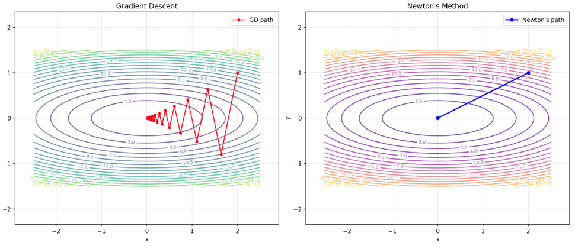
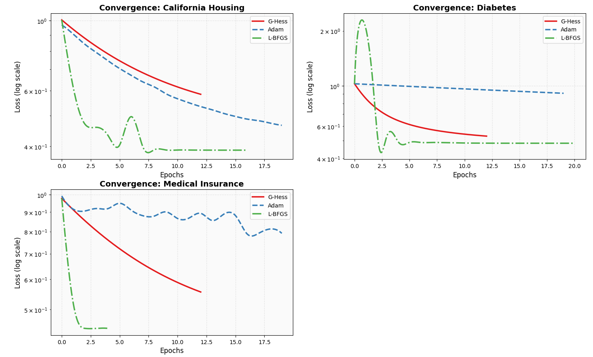
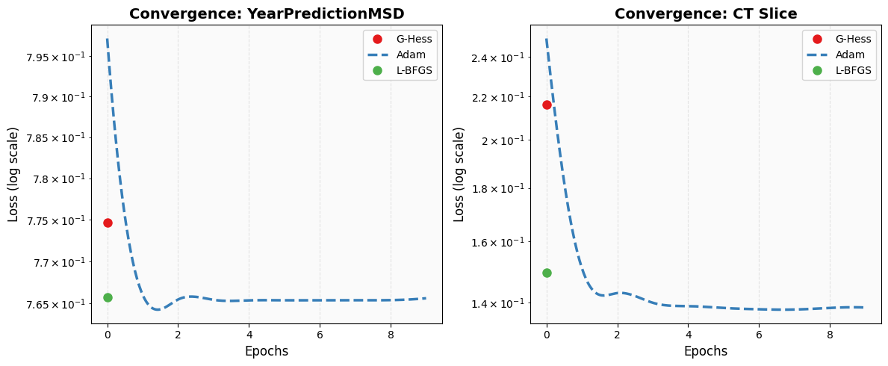
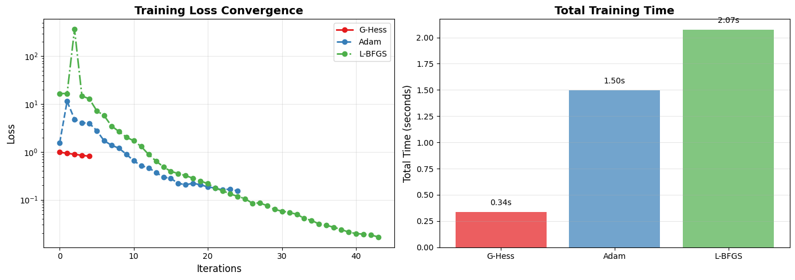

# G-Hess: Спектральная экстраполяция метрического тензора в квазиньютоновских методах оптимизации

[](https://www.python.org/downloads/)
[](https://opensource.org/licenses/MIT)

## 📌 Об исследовании

Данный репозиторий содержит реализацию и экспериментальное исследование адаптивного градиентного метода **G-Hess (Gamma-diagonal Hessian Gradient Descent)**, разработанного в рамках выпускной квалификационной работы. Метод основан на экстраполяции между евклидовой метрикой и диагональной аппроксимацией матрицы Гессе, что позволяет адаптивно регулировать шаг обучения для каждого параметра модели.

---

## Проблема стандартного подхода

GD игнорирует геометрию функции потерь, используя одинаковый шаг для всех направлений. Произведем локальную квадратичную аппроксимацию функции потерь в окрестности точки $w^*$:

$$\mathcal{L}(w^{*} + \delta) = \mathcal{L}(w^{*}) + \nabla_{w} \mathcal{L}(w^{*})^{\top}\delta + \frac{1}{2}\delta^{\top} H\delta$$

В точке минимума градиент обращается в ноль ($\nabla_w \mathcal{L}(w^*) = 0$), поэтому аппроксимация упрощается:

$$\mathcal{L}(w^* + \delta) \approx \mathcal{L}(w^*) + \frac{1}{2}\delta^{\top} H\delta$$

Линии уровня функции в окрестности минимума определяются уравнением:

$$\delta^{\top} H\delta = \text{const}$$

что представляет собой эллипсоид, ориентированный согласно собственным векторам матрицы Гессе $H$.

Евклидова метрика $\|\delta\|^2 = \delta^{\top} I\delta$ не учитывает эту геометрию, что приводит к медленной сходимости на оврагах и плохо обусловленных задачах.



*Рис. 1 — Градиентный спуск на функции с эллиптическими линиями уровня. Одинаковый шаг по всем направлениям приводит к "зигзагообразной" траектории.*

---

## Предложенный метод: G-Hess

### Ключевая идея

В отличие от стандартного градиентного спуска, использующего единый скалярный шаг обучения, метод G-Hess адаптирует шаг индивидуально для каждого параметра $w_i$ на основе локальной кривизны поверхности функции потерь.

Заменим евклидову метрику на параметризованную метрику с **векторным гиперпараметром** $\boldsymbol{\gamma} = (\gamma_1, \dots, \gamma_D)$, где каждое $\gamma_i$ соответствует своему параметру модели:

$$\mathcal{T}_{\boldsymbol{\gamma}} = (1-\boldsymbol{\gamma}) \odot I + \boldsymbol{\gamma} \odot (\mathcal{H} + \lambda I)$$

где:
- $\odot$ — произведение Адамара
- $\mathcal{H} = \text{diag}(H)$ — диагональная аппроксимация матрицы Гессе
- $\boldsymbol{\gamma} \in \mathbb{R}^D$ — векторный гиперпараметр, управляющий степенью учёта кривизны для каждого параметра
- $\lambda$ — малая константа регуляризации ($10^{-3}$)


---

## 🔬 Экспериментальные результаты

### Сравнение на стандартных датасетах

| Датасет | Размерность | G-Hess (время / loss) | Adam (время / loss) | L-BFGS (время / loss) |
|---------|-------------|----------------------|---------------------|-----------------------|
| **California Housing** | 8 | **0.0027с** / 0.570 | 0.0241с / **0.464** | 0.0041с / **0.417** |
| **Diabetes** | 10 | **0.0002с** / 0.492 | 0.0007с / 0.787 | 0.0007с / **0.488** |
| **Medical Insurance** | 6 | **0.0002с** / 0.627 | 0.0021с / 0.901 | 0.0002с / **0.511** |
| **YearPredictionMSD** | 90 | **0.0707с** / 0.801 | 0.6698с / **0.764** | 0.2081с / **0.764** |
| **CT Slice** | 384 | **0.0186с** / 0.159 | 0.1738с / **0.139** | 0.0592с / 0.150 |

### Результаты на высокоразмерных данных (E2006-tfidf, D=150 360)

| Алгоритм | Время (с) | Train Loss | **Test Loss** |
|----------|-----------|------------|---------------|
| **G-Hess** | **0.337** | 0.812 | **0.875** ✅ |
| **Adam** | 1.495 | 0.153 | **0.824** ✅ |
| **L-BFGS** | 2.072 | **0.017** | **4.294** ❌ (переобучение) |

> **Ключевой вывод**: L-BFGS достигает минимального значения на обучающей выборке, но катастрофически переобучается. G-Hess — метод, сочетающий высокую скорость и устойчивое обобщение на линейных и логистических моделях.

### Графики сходимости




*Рис. 2 — Динамика уменьшения функции потерь на наборах California Housing, Diabetes, Medical Insurance.*



*Рис. 3 — Динамика уменьшения функции потерь на наборах CT-Slice, YearPredictionMSD.*



*Рис. 4 — Сравнение на датасете E2006-tfidf.*

---

## 🛠 Установка и использование

### Требования
```bash
Python 3.8+
numpy >= 1.19.0
scikit-learn >= 0.24.0
matplotlib >= 3.3.0